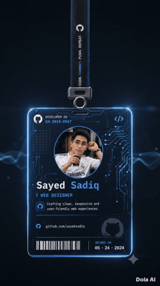

<!-- =========================
     Sayed Sadiq — Neon Web3 README
     ========================= -->

<!-- Header -->

  

<!-- Typing SVG -->

  

  🚀 <strong>Web3 Developer • Full-Stack Engineer • UI/UX Nerd</strong> 
  <em>“Building decentralized futures, one commit at a time.”</em>

---

# 🎬 Featured Video

  

---

# 🎮 GitHub Fun Zone — Neon Edition

  <!-- Chicken GIF -->
  

   

  <strong>🐔 My GitHub activity runs like a chicken!</strong>

  

---

# 💫 About Me

🔭 **Currently Building**

- 🛠️ **Tech Labs Hub – Web3 Tools & Experiments**  
  ➤ https://tech-labs-hub.vercel.app/web3

- 🗂️ **Project Hub Portal**  
  ➤ https://tech-project-hub.vercel.app/

- ⚡ **Next7 Ultra-Fast UI**  
  ➤ https://next7-by-sayed.vercel.app/

- 🏠 **My Portfolio Website**  
  ➤ https://sadiq-website.vercel.app/

---

👥 **Looking to Collaborate On**

- Web3 protocols, dApps, decentralized apps
- Next.js / React frontend systems
- Developer dashboards & tools
- Hackathons — deployment > sleep

---

💛 **I Can Help With**

- Smart contract architecture
- Web3 UX & modern UI
- CI/CD pipelines
- Large-scale frontend optimization

---

🌱 **Currently Learning**

- Solidity & Smart Contracts
- Advanced React patterns
- Next.js 14 App Router
- Ethers.js / Web3.js
- Massive-scale state management
- Web3 deployment strategies

---

💬 **Ask Me About**

- Full-stack dApp development
- Web3 developer journey
- Dev tools / workflows
- My caffeine-powered coding rituals ☕

---

⚡ **Fun Facts**

- Built a blockchain To-Do App — and actually used it 😂
- My GitHub graph is basically my second heartbeat
- I blend UI artistry with backend logic

---

  

---

# 🌐 Socials — Neon Badges

  

  

  

  

---

# 💻 Tech Stack

  

   

  

---

# 📊 GitHub Stats

  <!-- GitHub Stats -->
  <picture>
    <source
      media="(prefers-color-scheme: dark)"
      srcset="https://github-readme-stats.vercel.app/api?username=SayedSadiq45&show_icons=true&theme=radical&title_color=61DAFB&icon_color=61DAFB&text_color=C8E1FF&bg_color=0,091519,000000&border_color=3a8296"
    />

    
  </picture>

   

  <!-- Streak Stats -->
  <picture>
    <source
      media="(prefers-color-scheme: dark)"
      srcset="https://nirzak-streak-stats.vercel.app/?user=SayedSadiq45&theme=radical&background=0,000000,091519&ring=3a8296&fire=61DAFB&currStreakLabel=61DAFB"
    />

    
  </picture>

   

  <!-- Top Languages -->
  <picture>
    <source
      media="(prefers-color-scheme: dark)"
      srcset="https://github-readme-stats.vercel.app/api/top-langs/?username=SayedSadiq45&layout=compact&theme=radical&title_color=61DAFB&text_color=C8E1FF&bg_color=0,091519,000000&border_color=3a8296"
    />

    
  </picture>

---

# 🏆 GitHub Trophies

  

---

# ✍️ Random Dev Quote

  

---

# 🔝 Top Contributed Repos

  

---

  

---

<!-- Footer -->

  

